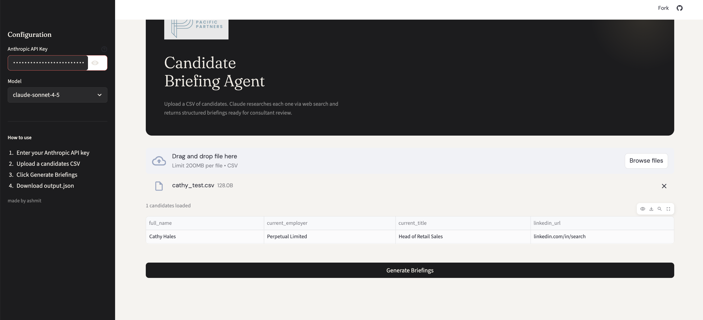
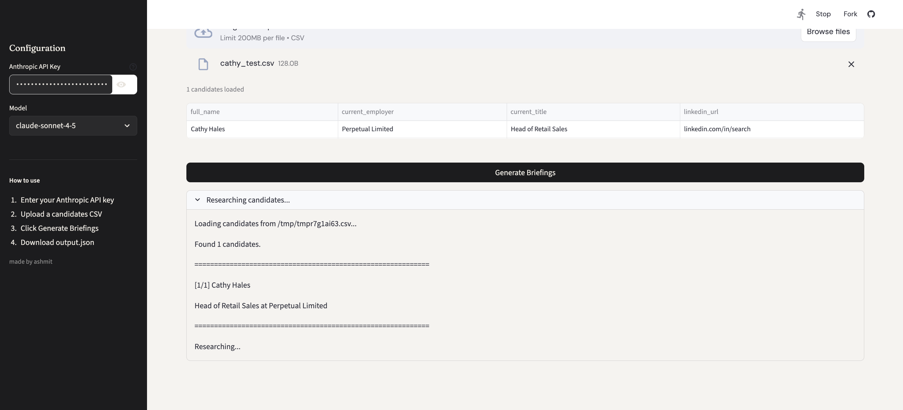
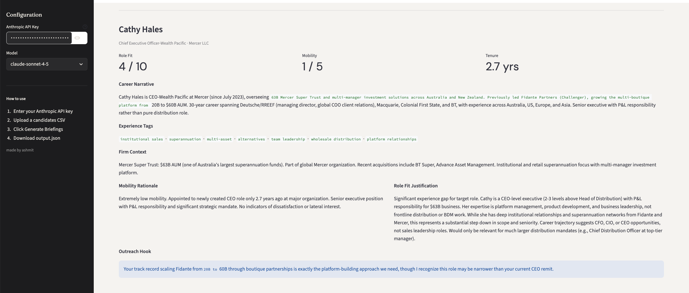

# PPP Candidate Briefing Agent

An AI agent that turns a CSV of candidate names into structured recruiter briefings. Built for [Platinum Pacific Partners](https://www.platinumpacificpartners.com.au/), a specialist executive search firm in Australian funds management.

The agent uses Claude's native web search to research each candidate from public sources, then produces a JSON briefing with career narrative, experience tags, firm AUM context, mobility signal, role fit score, and a personalised outreach hook.

🔗 **Live demo:** [ppp-candidate-briefing-agent.streamlit.app](https://ppp-candidate-briefing-agent.streamlit.app)

---

## Demo

**1. Upload a CSV and hit Generate**



**2. Agent researches each candidate in real time**



**3. Structured briefing rendered instantly**



---

## Quick Start

```bash
# 1. Clone and install
git clone <repo-url> && cd ppp-ai-task
pip install -r requirements.txt

# 2. Set your API key
cp .env.example .env
# Add your Anthropic API key to .env

# 3. Run
python run.py candidates.csv
```

Output lands in `output.json`. Takes around 10-15 minutes for 5 candidates due to rate limit cooldowns between steps.

## Usage

### CLI

```bash
python run.py candidates.csv
python run.py candidates.csv --output results.json
python run.py candidates.csv --model claude-opus-4-5
```

### Streamlit UI

```bash
streamlit run app.py
```

Upload a CSV, enter your Anthropic API key in the sidebar, click Generate. Briefings render in the browser with a download button for the JSON. The API key is not stored — it only exists for the session.

---

## Architecture

```
candidates.csv
      │
      ▼
┌─────────────┐
│   run.py    │  CLI entry point
└──────┬──────┘
       ▼
┌──────────────────────────────┐
│     agent/pipeline.py        │  loops candidates, calls research → briefing
└──────┬───────────────┬───────┘
       ▼               ▼
┌─────────────┐  ┌─────────────┐
│ researcher  │  │   briefer   │
│             │  │             │
│ Claude +    │  │ Claude →    │
│ web_search  │  │ strict JSON │
│ agentic     │  │             │
│ loop        │  │             │
└─────────────┘  └─────────────┘
       │               │
       ▼               ▼
  research text    structured JSON
                        │
                        ▼
                ┌──────────────┐
                │  schema.py   │  validates output
                └──────┬───────┘
                       ▼
                  output.json
```

**Two-step design:** research and briefing are separate Claude calls. Combining them in one call produced either shallow research or broken JSON. Splitting them fixed both — the research step runs as many searches as needed, the briefing step only has to worry about producing valid JSON.

**Agentic web search:** uses Claude's built-in `web_search_20250305` tool. Claude decides what to search and when to stop. No external search API needed.

**Graceful failure:** if research fails or a rate limit can't be recovered, the agent still produces valid schema-compliant JSON with a low confidence flag. The output is always readable, never a crash.

**Rate limiting:** 45 seconds between the research and briefing steps per candidate, 90 seconds between candidates. Keeps the free-tier token limit from being hit. Total runtime is around 10-15 minutes for 5 candidates.

---

## File Structure

```
ppp-ai-task/
├── run.py                  # CLI
├── app.py                  # Streamlit UI
├── agent/
│   ├── __init__.py
│   ├── pipeline.py         # orchestrator
│   ├── researcher.py       # step 1: web research
│   ├── briefer.py          # step 2: JSON generation
│   ├── prompts.py          # system prompts + role spec
│   └── schema.py           # output validation
├── screenshots/            # demo screenshots
├── candidates.csv
├── output.json
├── confidence_report.json
├── requirements.txt
├── design_note.md
├── .env.example
└── .gitignore
```

---

## Known Limitations

1. **LinkedIn:** LinkedIn blocks programmatic access. The agent uses web search results that reference LinkedIn content — news articles, press releases, announcements — so some career details may be incomplete or inferred.

2. **AUM figures:** sourced from industry publications and may be outdated. Flagged in the confidence report where unverified.

3. **Tenure:** without direct LinkedIn access, start dates are inferred from news coverage. Figures are approximate.

4. **Runtime:** ~10-15 minutes for 5 candidates due to rate limit cooldowns. Parallelising with asyncio would cut this to under 3 minutes.

5. **Thin profiles:** some candidates have limited public presence outside LinkedIn, which produces lower-confidence briefings. The agent flags these rather than guessing.

6. **Non-deterministic scores:** Claude runs fresh web searches each time, so scores may vary slightly between runs. The facts stay consistent; the interpretation doesn't always.

---

## What I'd Build Next

A few things I'd tackle with more time:

**LinkedIn access** is the obvious one. The agent is working with one hand tied behind its back without it. The LinkedIn API has limited access and requires candidate consent, but even a partial integration would improve data quality significantly.

**Async pipeline** — right now candidates run one at a time because of rate limits. With proper async handling and a higher-tier API account, all five could run in parallel and finish in 2-3 minutes instead of 15.

**CRM integration** — the briefings live in a JSON file, which isn't where a recruiter's workflow actually lives. Connecting output directly into Salesforce or whatever CRM PPP uses would close the loop and make this immediately actionable rather than a separate step.

**Editable briefings** — a production version would let consultants edit fields inline before exporting, rather than treating the output as read-only. A recruiter might want to add context from a phone call or flag something the agent missed.

See [design_note.md](design_note.md) for a longer discussion including one additional automation I'd build for PPP specifically.